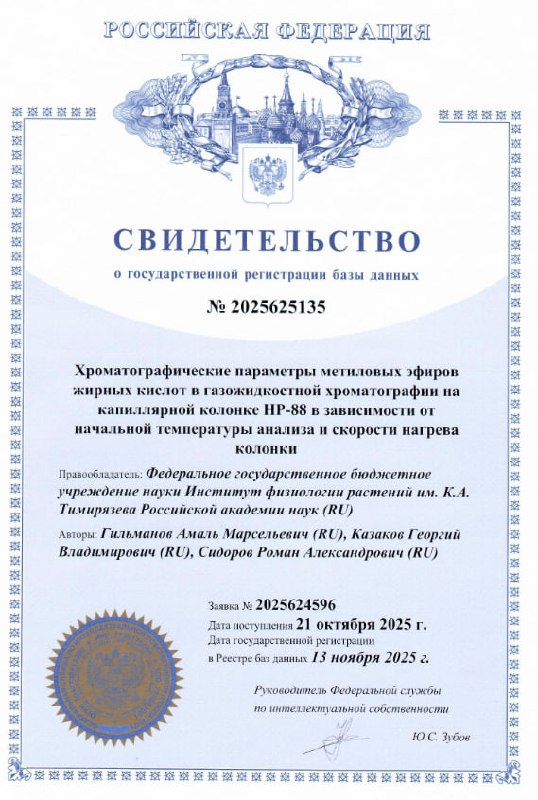

# CPFT

Chromatographic parameters of fatty acid methyl esters as function of
temperature

## Data

* ConstantFlow(1mL÷min,70C,7C÷min,Air) - воздух
* ConstantFlow(1mL÷min,150C,10C÷min,Air) - воздух

* ConstantFlow(1mL÷min,150C,8C) - сделана четвертая повторность
* ConstantFlow(1mL÷min,150C,9C) - сделана четвертая повторность
* ConstantFlow(1mL÷min,150C,10C) - сделана четвертая повторность

## Format

### 0.1.0

### 0.2.0

```
Schema:
name: Index, field: UInt32
name: Mode, field: Struct({'OnsetTemperature': Float64, 'TemperatureStep': Float64})
name: FattyAcid, field: Struct({'Carbon': UInt8, 'Indices': List(Struct({'Index': UInt8, 'Triple': Boolean, 'Parity': Boolean}))})
name: RetentionTime, field: List(Float64)
name: DeadTime, field: Float64
```

## Свидетельство о государственной регистрации базы данных 2025625135

Хроматографические параметры метиловых эфиров жирных кислот в газожидкостной
хроматографии на капиллярной колонке HP-88 в зависимости от начальной
температуры анализа и скорости нагрева колонки.

[](2025625135.png)

[fips.ru](https://new.fips.ru/registers-doc-view/fips_servlet?DB=DB&DocNumber=2025625135 "Federal Instute of Industrial Property")

**Дата регистрации**: 2025-11-13
